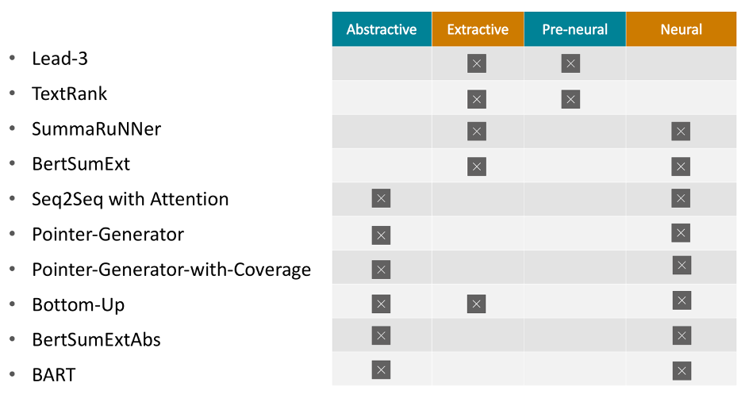

## What Have We Achieved on Text Summarization? 

This is the official repo for
* the EMNLP 2020 long paper [What Have We Achieved on Text Summarization? ](https://www.aclweb.org/anthology/2020.emnlp-main.33.pdf)

<div>

</div>

1. [Motivation](#motivation)
1. [Released Data](#data)
1. [Evaluation Tool](#tool)
1. [Bibtex](#bibtex)

<a name="motivation"></a>
#### Motivation
Within the decades, Automatic Text Summarization has been developed greatly from the traditional statistical way to nowadays neural architectures. We concern two questions in this domain: 1) overall, what have we achieved on text summarization? 2) what fundamental changes each milestone technique has brought to summarization systems?

We conduct an empirical analysis on 10 representative summarization models by using an error-guided and fine-grained framework of evaluation metric (PolyTope). These 10 models include pre-neural and neural methods, extractive and abstractive methods, and milestone techniques such as copy, coverage, pre-training and hybrid.

The main goal of this work is to investigate the differences between summarization systems. Nonetheless, our dataset gives us a test bed to meta-evaluate the commonly used evaluation metrics like ROUGE, Pyramid, Ranking, etc. Thus, we also report a contrast between ROUGE and PolyTope quantitatively, and between PolyTope and other human evaluation metrics qualitatively to demonstrate why we used PolyTope for our research goal.

<a name="data"></a>
#### Released Data 
There are 10 system outputs. For each system, we have 150 trials from the non-anonymized CNN/DM dataset for human evaluation.




* [Outputs](./outputs)
* [Outputs with human annotation](#)

<a name="tool"></a>
#### Evaluation Tool
* [Issue Types](./IssueTypes.xlsm)
* [Labels](./Labels.xlsm)
* [Decision Tree](./DecosionTree.xlsx)
* [Guidelines](./GuideLines.xlsx)
* [Template](./AnnotationTemplate.xlsm)

<a name="bibtex"></a>
#### Bibtex
```
@inproceedings{huang2020have,
  title={What Have We Achieved on Text Summarization?},
  author={Huang, Dandan and Cui, Leyang and Yang, Sen and Bao, Guangsheng and Wang, Kun and Xie, Jun and Zhang, Yue},
  booktitle={Proceedings of the 2020 Conference on Empirical Methods in Natural Language Processing (EMNLP)},
  pages={446--469},
  year={2020}
}
```